# Memoria Técnica - Moon Cards

**Juego de Memoria con JavaScript Vanilla y POO**

---

## Contenido

1. [Introducción](#introducción)
2. [Objetivos del Proyecto](#objetivos-del-proyecto)
3. [Arquitectura de la Aplicación](#arquitectura-de-la-aplicación)
4. [Implementación](#implementación)
5. [Pruebas y Validación](#pruebas-y-validación)
6. [Gestión del Proyecto](#gestión-del-proyecto)
7. [Desafíos y Soluciones](#desafíos-y-soluciones)
8. [Conclusiones](#conclusiones)

---

## Introducción

**Moon Cards** es una aplicación web que integra conceptos fundamentales de desarrollo web moderno: JavaScript orientado a objetos, manipulación del DOM, consumo de APIs externas y gestión del almacenamiento local.

**Objetivo académico**: Demostrar comprensión de POO, asincronía, patrones de diseño y buenas prácticas de desarrollo web.

---

## Objetivos del Proyecto

### Objetivos Funcionales
1. Crear un juego de memoria con 12 cartas (6 parejas)
2. Implementar un sistema de autenticación de usuarios
3. Integrar una API externa para obtener datos dinámicos
4. Permitir un filtrado de contenido por popularidad
5. Guardar estado de sesión de usuario en localStorage

### Objetivos Técnicos
1. Aplicar principios de Programación Orientada a Objetos (POO)
2. Separar lógica de presentación usando patrones de servicio
3. Manejar promesas y operaciones asincrónicas con `async/await`
4. Validar datos de entrada en constructores
5. Crear interfaz responsiva

### Objetivos de Aprendizaje
1. Entender ciclo de vida de una aplicación web
2. Dominar manipulación del DOM
3. Implementar arquitectura escalable
4. Documentación técnica

---

## Arquitectura de la Aplicación

### 1. Patrón Arquitectónico: MVC Simplificado

```
┌─────────────────────────────────────────────────┐
│              index.html (Vista)                  │
│  - Paneles: Login, Registro, Board, Usuario      │
│  - Elementos DOM manipulados dinámicamente       │
└──────────────────┬──────────────────────────────┘
                   │ manipula
                   ↓
┌─────────────────────────────────────────────────┐
│     Controlador (script en index.html)          │
│  - initApp(), initPanelBoard()                  │
│  - initPanelLogin(), initPanelRegistro()        │
│  - initPanelUsuario()                           │
└──────────────────┬──────────────────────────────┘
                   │ utiliza
                   ↓
┌──────────────────────────────────────────────────────┐
│                 Modelos + Servicios                   │
├──────────────────────────────────────────────────────┤
│ Models:                                               │
│  ├─ User (name, email, password)                     │
│  ├─ Card (id, name, imageUrl, isHidden)              │
│  └─ Board (container, cards[], selectedHueco)        │
│                                                       │
│ Services:                                             │
│  ├─ UserService (saveUser, loadUser, login, logout)  │
│  ├─ CardService (getCardFromRow, getCardsFromRawData)│
│  └─ ApiService (getCharacters)                       │
└──────────────────────────────────────────────────────┘
```




### 2. Capas de la Aplicación

#### Capa de Presentación (UI)
- `index.html`: Estructura y elementos del DOM
- `css/app.css`: Estilos principales
- `css/form.css`: Estilos de formularios

#### Capa de Lógica (Controllers/Services)
- `UserService.js`: Gestión de usuarios y autenticación
- `CardService.js`: Transformación de datos de API → objetos Card
- `ApiService.js`: Comunicación con Jikan API

#### Capa de Modelos (Data)
- `User.js`: Entidad de usuario con validaciones
- `Card.js`: Entidad de carta individual con generación de DOM
- `Board.js`: Entidad que gestiona el tablero y la lógica del juego

#### Capa de Persistencia
- `localStorage`: Almacenamiento local de usuarios y sesión activa

### 3. Flujo de Datos

```
Inicio App
    ↓
¿currentUser en localStorage?
    ├─ Sí → Mostrar Board Panel + Usuario Panel
    │        ↓
    │     ApiService.getCharacters() → array de personajes (Jikan)
    │        ↓
    │     (opcional) filtrar por d.favorites >= 500
    │        ↓
    │     CardService.getCardsFromRawData() → Map<id, Card>
    │        ↓
    │     Board.prepareCards(cards) → Array barajado de 12 cartas
    │        ↓
    │     Board.render() → elementos DOM con event listeners
    │
    └─ No → Mostrar Login Panel
             ↓
          Usuario elige:
             ├─ Login → UserService.login() → location.reload()
             └─ Registro → UserService.saveUser() + login() → reload()
```

---

## Implementación

### 1. Estructura de Archivos

```
js/
├── models/
│   ├── User.js
│   ├── Card.js
│   └── Board.js
└── services/
    ├── UserService.js
    ├── CardService.js
    └── ApiService.js

css/
├── app.css
└── form.css

assets/
├── favicon.ico
├── logo.png
├── diagrama_flujo.svg
└── diagrama_UML.svg

index.html
```

### 2. Patrones Implementados

#### Patrón Singleton / Métodos Estáticos (Servicios)
```javascript
// UserService.js — todos los métodos son estáticos
export default class UserService {
  static saveUser(user) { ... }
  static login(name, password) { ... }
  static logout() { ... }
  static getActualLogin() { ... }
}

// Uso: sin necesidad de instanciar
UserService.login("Saray", "123456")
```

**Ventaja**: Evita múltiples instancias innecesarias; actúa como módulo de utilidades.

#### Patrón Factory (CardService)
```javascript
// CardService.js
static getCardFromRow(row) {
  const ch = row.character;
  return new Card(ch.mal_id, ch.name, ch.images.jpg.image_url);
}

static getCardsFromRawData(data) {
  const cards = new Map();
  for (let row of data) {
    const card = this.getCardFromRow(row);
    cards.set(card.id, card);
  }
  return cards;
}
```

**Ventaja**: Encapsula y centraliza la lógica de creación de objetos Card.

#### Patrón Observer (Eventos DOM)
```javascript
// Board.js — dentro de render()
cardElement.addEventListener("click", (event) => {
  let idCarta = event.target.dataset.id;
  let hueco = event.target.parentElement.parentElement.parentElement.dataset.hueco;
  if (hueco == null) {
    hueco = event.target.dataset.hueco;
  }
  this.click(hueco, idCarta);
});
```

**Ventaja**: Desacoplamiento entre la UI y la lógica del tablero.

### 3. Manejo de Asincronía

```javascript
// ApiService.js
static async getCharacters() {
  const url = `${this.BASE_URL}/anime/31733/characters`;
  const response = await fetch(url);
  if (!response.ok) {
    throw new Error(`Error al obtener personajes: ${response.status}`);
  }
  const json = await response.json();
  return json.data;
}

// Board.js — delay para UX
async click(hueco, idCard) {
  const sleep = (ms) => new Promise(resolve => setTimeout(resolve, ms));
  this.showCardFromHueco(hueco);

  if (this.selectedHueco == null && this.selectedHueco != hueco) {
    this.selectedHueco = hueco;
  } else if (this.selectedHueco != hueco) {
    await sleep(300); // El usuario puede ver ambas cartas antes de ocultarlas
    // lógica de comparación...
    this.selectedHueco = null;
  }
}
```

### 4. Acceso al Tablero por Hueco 

`Board.prepareCards()` devuelve un **Array** barajado de 12 cartas, que se asigna a `board.cards`. Las cartas se acceden por su índice de posición (hueco), no por ID:

```javascript
// Board.js
showCardFromHueco(hueco) {
  let elem = document.querySelector(`[data-hueco="${hueco}"] .card-inner`);
  let card = this.cards[hueco]; // acceso por índice
  elem.classList.remove("hidden");
  card.isHidden = false;
}

hideCardFromHueco(hueco) {
  let elem = document.querySelector(`[data-hueco="${hueco}"] .card-inner`);
  let card = this.cards[hueco]; // acceso por índice
  elem.classList.add("hidden");
  card.isHidden = true;
}
```

El hueco se almacena como `data-hueco` en el elemento DOM durante `render()`:
```javascript
cardElement.dataset.hueco = hueco;
hueco++;
```

### 5. Validaciones Implementadas

#### En User.js
```javascript
constructor(name, email, password) {
  if (!name || name.trim() === "")
    throw new Error("El nombre no puede estar vacío");
  if (!email || !email.includes("@"))
    throw new Error("El email es inválido");
  if (!password || password.length < 6)
    throw new Error("La contraseña debe tener por lo menos 6 caracteres");
}
```

#### En Card.js
```javascript
constructor(id, name, imageUrl, isHidden = true) {
  if (!id)
    throw new Error("El ID de la carta no puede estar vacío");
  if (!name || name.trim() === "")
    throw new Error("El nombre de la carta no puede estar vacío");
  if (!imageUrl || typeof imageUrl !== "string")
    throw new Error("La carta debe tener una URL de imagen válida");
  if (typeof isHidden !== "boolean")
    throw new Error("isHidden debe ser un valor booleano, true o false");
}
```

### 6. Generación de Elementos DOM (Card.js)

```javascript
createDomElement() {
  const newCard = document.createElement('div');
  newCard.className = 'card';
  newCard.dataset.id = this.id;
  let hidden = this.isHidden ? "hidden" : "";

  newCard.innerHTML = `
    <div data-id="${this.id}" class="card-inner ${hidden}">
      <div data-id="${this.id}" class="card-front"></div>
      <div data-id="${this.id}" class="card-back">
        
      </div>
    </div>
  `;
  return newCard;
}
```

El `data-id` se propaga a todos los elementos internos para que cualquier punto de clic dentro de la carta devuelva el ID correcto.

### 7. Persistencia con localStorage (UserService.js)

```javascript
// Guardar usuario (clave = nombre de usuario)
static saveUser(user) {
  localStorage.setItem(user.name, JSON.stringify(user));
}

// Cargar usuario por nombre
static loadUser(userName) {
  const data = localStorage.getItem(userName);
  const obj = JSON.parse(data);
  return new User(obj.name, obj.email, obj.password);
}

// Sesión activa
static login(userName, password) {
  const user = this.loadUser(userName);
  if (user.password !== password) throw new Error("La contraseña es incorrecta");
  localStorage.setItem("currentUser", JSON.stringify(user));
  return user;
}

static logout() {
  localStorage.removeItem("currentUser");
}
```

---

## Pruebas y Validación

### 1. Pruebas Funcionales Manuales

| Test | Entrada | Salida Esperada | Resultado |
|------|---------|-----------------|-----------|
| Login válido | Saray / 123456 | Acceso al board | Pasa |
| Login inválido | User / wrong | Sin acceso | Pasa |
| Registro nuevo usuario | Datos válidos | Acceso al board | Pasa |
| Click primera carta | Click en carta | Se voltea | Pasa |
| Click segunda carta — coincide | Misma pareja | Ambas permanecen visibles | Pasa |
| Click segunda carta — no coincide | Pareja distinta | Se ocultan tras 300ms | Pasa |
| Victoria | Todas las parejas encontradas | Alert + recarga | Pasa |
| Filtro popular | Activar checkbox | Solo personajes ≥500 favoritos | Pasa |
| Logout | Clic en Logout | Regresa a Login | Pasa |

### 2. Pruebas de Validación de Datos

```javascript
// User — nombre vacío
try {
  new User("", "test@test.com", "123456");
} catch (e) {
  console.log(e.message); // "El nombre no puede estar vacío"
}

// User — email inválido
try {
  new User("Test", "invalidemail", "123456");
} catch (e) {
  console.log(e.message); // "El email es inválido"
}

// Card — ID vacío
try {
  new Card(null, "Sailor Moon", "https://...");
} catch (e) {
  console.log(e.message); // "El ID de la carta no puede estar vacío"
}
```

### 3. Pruebas de API

```javascript
fetch('https://api.jikan.moe/v4/anime/31733/characters')
  .then(r => r.json())
  .then(data => {
    console.log(data.data.length);                          // > 0
    console.log(data.data[0].character.name);               // Nombre del personaje
    console.log(data.data[0].character.images.jpg.image_url); // URL de imagen
    console.log(data.data[0].favorites);                    // Número de favoritos
  });
```

---

## Gestión del Proyecto

### Metodología

**Fase 1 — Planificación**: Definición de requisitos y diseño de arquitectura.

**Fase 2 — Desarrollo de Modelos**: Implementación de `User.js`, `Card.js`, `Board.js` y los tres servicios.

**Fase 3 — Integración UI**: HTML y CSS base, conexión de eventos, integración de API y sistema de autenticación.

**Fase 4 — Pruebas**: Pruebas funcionales, validaciones, documentación y optimización.

### Herramientas Utilizadas

- **Editor**: Visual Studio Code
- **Versionado**: Git
- **Repositorio**: GitHub
- **Servidor Local**: Live Server (extensión de VSCode)
- **Navegadores Probados**: Chrome, Firefox, Opera Mini

---

## Desafíos y Soluciones

### Desafío 1: Acceso a cartas por posición vs por ID

**Problema**: El tablero necesita dos formas de identificar una carta: su *posición en el tablero* (hueco 0–11) para saber cuál fue clicada, y su *ID de personaje* para comparar si dos cartas forman pareja.

**Solución implementada**:
```javascript
// El hueco se almacena en el dataset del elemento raíz de la carta
cardElement.dataset.hueco = hueco;

// En el handler del click, se recuperan ambos datos del evento
let idCarta = event.target.dataset.id;
let hueco = event.target.parentElement.parentElement.parentElement.dataset.hueco;

// La comparación usa el ID de personaje (no el hueco)
if (firstCard.id == secondCard.id) { /* pareja encontrada */ }
```

**Lección**: Es necesario distinguir entre identidad (ID del personaje) y posición (hueco en el tablero).

### Desafío 2: Timing en comparación de cartas

**Problema**: Sin retardo, las cartas no coincidentes se ocultaban tan rápido que el usuario no podía verlas.

**Solución implementada**:
```javascript
const sleep = (ms) => new Promise(resolve => setTimeout(resolve, ms));
await sleep(300); // Pausa de 300ms antes de ocultar
```

**Lección**: Los delays mejoran significativamente la experiencia de usuario en juegos de memoria.

### Desafío 3: Propagación del data-id en los elementos de la carta

**Problema**: Al hacer clic en cualquier parte de la carta (imagen, cara delantera, cara trasera), el `event.target` podía ser un elemento hijo que no tenía el `data-id` correcto.

**Solución implementada**: El `data-id` se añade a todos los elementos hijos de la carta en `createDomElement()`, de modo que siempre está disponible independientemente del punto exacto de clic.

**Lección**: En estructuras DOM anidadas, hay que considerar en qué nivel se colocan los atributos de datos.

### Desafío 4: Validación de email simple

**Problema**: La validación con `.includes("@")` es muy laxa.

**Solución implementada**:
```javascript
if (!email || !email.includes("@"))
  throw new Error("El email es inválido");
```

**Nota técnica**: En producción se debería usar una expresión regular más completa:
```javascript
const emailRegex = /^[^\s@]+@[^\s@]+\.[^\s@]+$/;
if (!emailRegex.test(email)) throw new Error("El email es inválido");
```

### Desafío 5: Estado global sin framework

**Problema**: Múltiples paneles necesitan comunicarse sin un framework de estado.

**Solución implementada**:
```javascript
// Variables de referencia a paneles en el scope del script principal
const panelLogin = document.querySelector("#loginPanel");
const panelRegistro = document.querySelector("#registroPanel");
const panelBoard = document.querySelector("#panelBoard");
const panelUsuario = document.querySelector("#usuarioPanel");

function mostrarPanel(panel) { panel.classList.remove("hidden"); }
function ocultarPaneles() {
  panelLogin.classList.add("hidden");
  panelRegistro.classList.add("hidden");
  panelBoard.classList.add("hidden");
  panelUsuario.classList.add("hidden");
}
```

**Lección**: La gestión de visibilidad por clases CSS es simple, predecible y suficiente para proyectos de esta escala.

---

## Conclusiones

**La arquitectura importa**: separar modelos, servicios y vistas hace el código mantenible y más fácil de depurar.

### Posibles Mejoras Futuras

- Contador de intentos por partida
- Efectos de sonido en eventos (volteo, pareja, victoria)
- Modo oscuro
- Validación de email con regex
- Mensaje de error visible en el formulario de login cuando las credenciales son incorrectas

### Reflexión Final

Moon Cards demuestra que es posible construir una aplicación web funcional usando solo JavaScript vanilla con una arquitectura bien estructurada. Comprender los fundamentos de la POO, encapsulación, separación de responsabilidades, patrones de diseño es esencial para escribir código mantenible, independientemente del framework que se use después.

---

## Referencias

- **MDN Web Docs**: https://developer.mozilla.org
- **Jikan API**: https://jikan.moe
- **Sailor Moon en MyAnimeList**: https://myanimelist.net/anime/31733
- **ES6 Classes**: https://developer.mozilla.org/en-US/docs/Web/JavaScript/Reference/Classes
- **localStorage API**: https://developer.mozilla.org/en-US/docs/Web/API/Window/localStorage